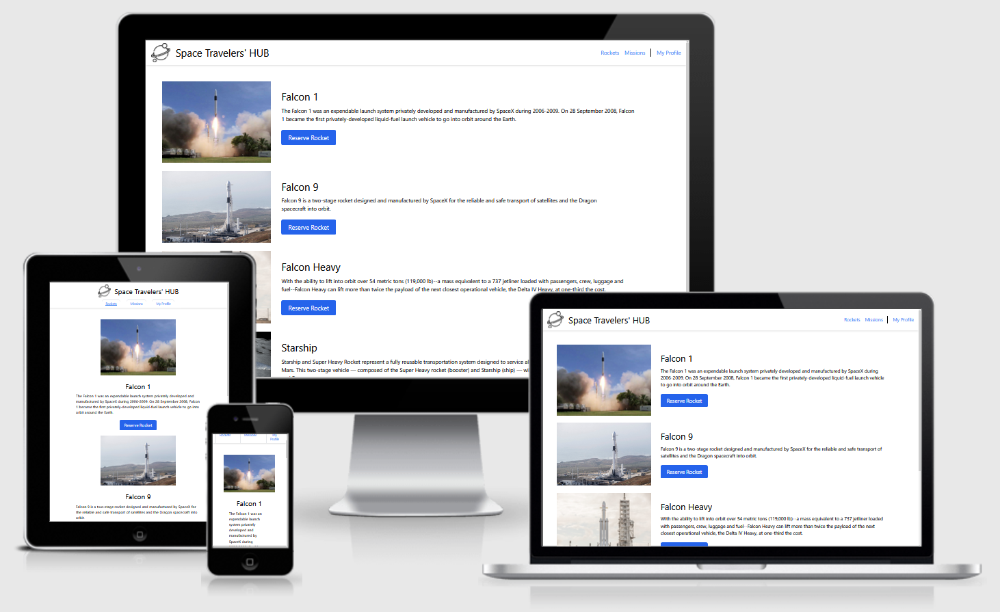

# Space Traveler's HUB

Welcome to Space Traveler's HUB, in this web app you will be able to take a fictional tour accross the space.

- You can choose a rocket from our catalog interface, and reserve ir for you.
- Also, you can see information of the most famous recent spacial missions and join them.
- Finally, in MyProfile interface you will be able to keep track of all your rockets and mission you are subscribed.

### 🖥️ Desktop version

#### This is the home page, where you can see and interact with the available rockets

#### This is the missions page, where you can join and read about the available missions

#### Finally, this interface will help you to keep track of the rockets and mission you joined

### 📱 Mobile version

Here you can take a look at the different pages for the mobile version

#### Home Page

#### Missions Page

#### My Profile Page

## ✅ Learning objectives

- Fetch data from a public API
- Implement state management with react-redux
- Render fetched data on screen
- Implement a profile interface with user reserved missions and rockets

## 🧩 Built With

- React.js
- React-router
- Redux
- TailwindCSS
- Webpack

## 📚 Getting Started

To get a local copy up and running follow these simple example steps.

### Prerequisites

For this project you don't need aditional tools

<!-- For this project to run you will need the following tools:
- requisite -->

### Setup

Fork a copy to your repository

### Install

Clone the repository on your local enviroment and run `npm i` on your terminal

### Usage

To start the dev server just run `npm start`.
You can work in your favorite Code Editor

## 💻📱 Live Preview

<!-- There is no Live Demo available at the moment -->

If you want to see a live demo of this project, [click here](https://react-space-travelers-hub.herokuapp.com/)

## Authors

👤 **Mihreteab Misganaw Aride**

- GitHub: [@Mre55](https://github.com/Mre55)
- Twitter: [@MreMisganaw](https://twitter.com/MreMisganaw)
- LinkedIn: [@Mihreteab-Aride](https://www.linkedin.com/in/mihreteabaride/)

👤 **William Morales**

- GitHub: [@williamrolando88](https://github.com/williamrolando88)
- Twitter: [@WillyMorales93](https://twitter.com/WillyMorales93)
- LinkedIn: [William Morales](https://www.linkedin.com/in/william-morales-palma/)

## 🤝 Contributing

Contributions, issues, and feature requests are welcome!

Feel free to check the [issues page](../../issues).

## 👏 Show your support

Give a ⭐️ if you like this project!

<!-- ## 👍 Credits -->

<!--
GUI & Graphic Design: Cindy Shin

- Behance: [Cindy Shin](https://www.behance.net/adagio07)
-->

## 📝 License

Copyright (c) 2022 William Morales, Mihreteab Misganaw

Permission is hereby granted, free of charge, to any person obtaining a copy of this software and associated documentation files (the "Software"), to deal in the Software without restriction, including without limitation the rights to use, copy, modify, merge, publish, distribute, sublicense, and/or sell copies of the Software, and to permit persons to whom the Software is furnished to do so, subject to the following conditions:

The above copyright notice and this permission notice shall be included in all copies or substantial portions of the Software.

THE SOFTWARE IS PROVIDED "AS IS", WITHOUT WARRANTY OF ANY KIND, EXPRESS OR IMPLIED, INCLUDING BUT NOT LIMITED TO THE WARRANTIES OF MERCHANTABILITY, FITNESS FOR A PARTICULAR PURPOSE AND NONINFRINGEMENT. IN NO EVENT SHALL THE AUTHORS OR COPYRIGHT HOLDERS BE LIABLE FOR ANY CLAIM, DAMAGES OR OTHER LIABILITY, WHETHER IN AN ACTION OF CONTRACT, TORT OR OTHERWISE, ARISING FROM, OUT OF OR IN CONNECTION WITH THE SOFTWARE OR THE USE OR OTHER DEALINGS IN THE SOFTWARE.
